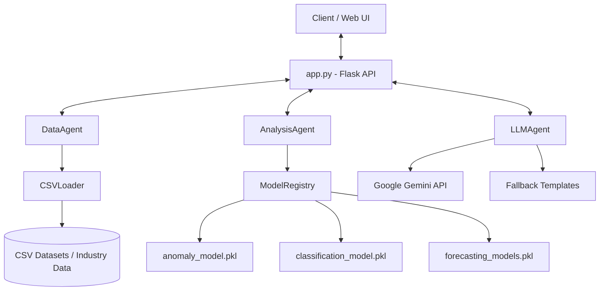
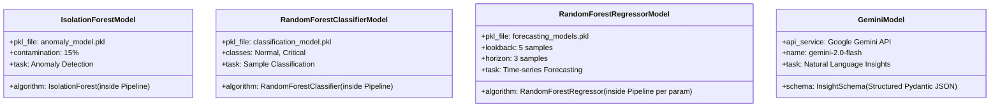
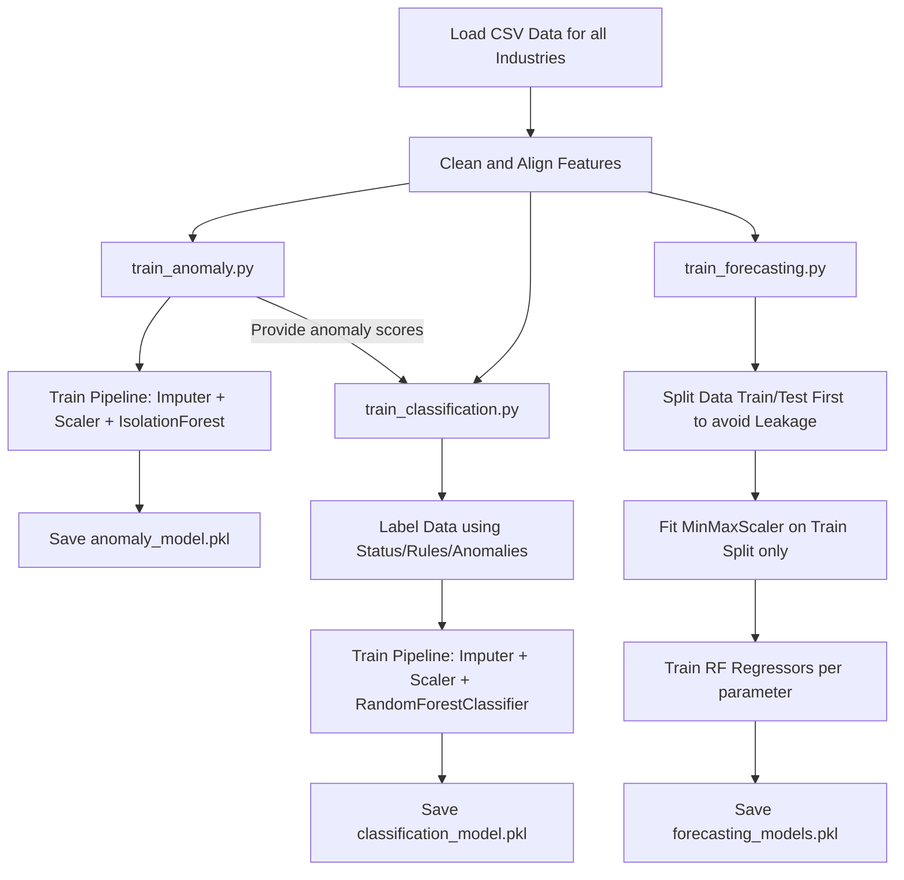

# Wastewater Analysis AI Agents - Repository Context & Documentation

This document provides a comprehensive overview of the `HEEPL-AI-Agents` repository. It serves as a guide for understanding the architecture, agents, models, API structure, training pipelines, and deployment setup.

---

## 1. Architecture Report

The Wastewater Analysis AI Agents repository is a Flask-based service designed to process industrial wastewater quality samples, perform machine learning analysis, and generate natural language insights.

### System Diagram



### Architecture Breakdown

*   **API Layer (`app.py`)**: Exposes REST endpoints, CORS configurations, testing APIs, and pre-warm model health checks.
*   **Agent Layer (`agents/`)**: Three core agents (`DataAgent`, `AnalysisAgent`, `LLMAgent`) coordinate distinct aspects of the system.
*   **Model Registry & Persistence (`models/`)**: Manages lazy loading of serialized machine learning pipelines.
*   **Data Processing Layer (`utils/csv_loader.py`)**: Handles robust, multi-strategy CSV ingestion, column header standardization, dynamic column typing, and median-imputation.
*   **Configuration & Thresholds (`config/`)**:
    *   `mappings.py`: Defines mappings between industry IDs and their corresponding CSV file paths.
    *   `thresholds.py`: Centralized source of truth for CPCB/EPA wastewater safety limits (BOD, COD, TSS, TDS, pH, etc.) and validation helper functions.

### Data Flow

1.  **Request Ingestion**: A client sends wastewater sample values to the API.
2.  **Preprocessing**: The data is standardized and cleaned by `CSVLoader`.
3.  **Analysis**: `AnalysisAgent` checks static regulatory thresholds via `config/thresholds.py` to log immediate warnings or critical violations. If ML is enabled, features are processed and predictions are run directly through the scikit-learn `Pipeline` objects loaded from `models/`.
4.  **Insight Generation**: The analysis results are compiled and sent to `LLMAgent`. The agent creates a prompt enriched with industry-specific context and queries the Gemini API with a strict JSON Pydantic response schema to avoid text-parsing failures.
5.  **Serialization**: The combined metrics and structured insights are formatted and returned to the client as a JSON response.

---

## 2. Agent Inventory

The repository implements three main agents with specialized responsibilities:

| Agent Name | Location | Primary Responsibilities | Core Dependencies |
| :--- | :--- | :--- | :--- |
| **`DataAgent`** | [`agents/data_agent.py`](file:///Users/abhishekchaubey/Programming/HEEPL/main/HEEPL-AI-Agents/agents/data_agent.py) | Loading datasets, computing summary metrics (means, medians, IQR), identifying correlation matrices, preparing time series arrays. | `pandas`, `numpy`, `CSVLoader` |
| **`AnalysisAgent`** | [`agents/analysis_agent.py`](file:///Users/abhishekchaubey/Programming/HEEPL/main/HEEPL-AI-Agents/agents/analysis_agent.py) | Running sample data through scikit-learn pipelines, checking regulatory limit violations via centralized thresholds, orchestrating fallbacks if models fail. | `ModelRegistry`, `CSVLoader`, `config/thresholds.py` |
| **`LLMAgent`** | [`agents/llm_agent.py`](file:///Users/abhishekchaubey/Programming/HEEPL/main/HEEPL-AI-Agents/agents/llm_agent.py) | Generating structured text summaries, findings, and recommendations. Injects industry context and connects to Gemini with strict schema enforcement. | `google-genai` (Gemini API Client), `pydantic` |

---

## 3. API Inventory

The Flask application exposes the following endpoints:

### System & Health (Diagnostics)

*   **`GET /health`**
    *   *Description*: Diagnostic health check endpoint.
    *   *Response*: Checks local model pipeline file presence and Gemini API credentials configuration.
*   **`GET /`**
    *   *Description*: API index detailing available endpoints.

### Industry Data & Statistics

*   **`GET /industries`**
    *   *Description*: Returns a list of all defined industries, indicating whether they have CSV datasets available and their sample counts.
*   **`GET /industries/<industry_id>`**
    *   *Description*: Returns basic statistics, status distributions, and a preview of sample rows for a specific industry.
*   **`GET /industries/<industry_id>/stats`**
    *   *Description*: Returns statistics (mean, std, min, max) for each water characteristic parameter.
*   **`GET /columns/<industry_id>`**
    *   *Description*: Details available core, optional, and missing columns for a given industry.

### Analysis & Insights

*   **`POST /industries/<industry_id>/analyze`**
    *   *Description*: Analyzes a single sample (JSON body) under a given industry's context.
*   **`POST /industries/<industry_id>/analyze/batch`**
    *   *Description*: Batch-analyzes multiple samples.
*   **`POST /analyze/sample`**
    *   *Description*: Analyzes a single sample without requiring industry context.
*   **`POST /industries/<industry_id>/insights`**
    *   *Description*: Analyzes a sample and generates natural language insights.
*   **`POST /analyze/with-insights`**
    *   *Description*: One-stop endpoint returning both structured analysis and natural language insights.
*   **`POST /insights/batch`**
    *   *Description*: Summarizes a batch of samples into an executive report.

### Model Training (Admin)

*   **`POST /train/anomaly`**: Retrains the anomaly detection model.
*   **`POST /train/classification`**: Retrains the classification model.
*   **`POST /train/forecasting`**: Retrains the forecasting model.
*   **`POST /train/all`**: Trains all three models sequentially.

### Testing & Debugging APIs (v1)

*   **`POST /api/v1/test/data`**
    *   *Description*: Validates the `DataAgent` loader and stats calculation routines.
*   **`POST /api/v1/test/analysis`**
    *   *Description*: Validates the `AnalysisAgent` model pipelines and static thresholds using mock inputs.
*   **`POST /api/v1/test/llm`**
    *   *Description*: Verifies prompt construction and `LLMAgent` structured schema parsing.

---

## 4. Model Inventory

The system utilizes four models (three local scikit-learn models and one cloud-based LLM):



### Model Specifications

1.  **Anomaly Detection Model (`anomaly_model.pkl`)**
    *   *Algorithm*: Isolation Forest (`sklearn.ensemble.IsolationForest`) wrapped inside a pipeline with `SimpleImputer` and `StandardScaler`.
    *   *Features*: Values of BOD, COD, TSS, TDS, pH, Oil & Grease, Ammonia, Conductivity, and Temperature.
2.  **Classification Model (`classification_model.pkl`)**
    *   *Algorithm*: Random Forest Classifier (`sklearn.ensemble.RandomForestClassifier`) wrapped inside a pipeline with `SimpleImputer` (median) and `StandardScaler`.
    *   *Labels*: Classified into `Normal`, `Warning`, or `Critical`.
3.  **Forecasting Model (`forecasting_models.pkl`)**
    *   *Algorithm*: Multiple Random Forest Regressors (`sklearn.ensemble.RandomForestRegressor`) fitted on sequences prepared using MinMaxScaler.
    *   *Mechanism*: Fixed Data Leakage by fitting MinMaxScaler strictly on training intervals (excluding test ranges).
4.  **Generative Insights Model (Gemini)**
    *   *Model Name*: `gemini-2.0-flash` (with flash fallback).
    *   *Mechanism*: Uses strict Pydantic structures to output standard JSON data schema, eliminating text-parsing failures.

---

## 5. Training Pipeline Analysis

The training scripts reside in the `training/` folder:



### Pipeline Details

*   **`train_anomaly.py`**:
    1. Loads and concatenates data from all 50+ industries.
    2. Imputes missing features with the mean, standardizes inputs, and fits the `IsolationForest` all inside a scikit-learn `Pipeline`.
    3. Prints validation statistics (mean anomaly scores, StdDev) and feature-impact correlations.
*   **`train_classification.py`**:
    1. Loads all industry data.
    2. Maps labels using static regulatory limits from `config/thresholds.py`.
    3. Fits `RandomForestClassifier` with balanced class weights inside an sklearn `Pipeline`. Prints classification reports (Precision, Recall, F1) and CV scores.
*   **`train_forecasting.py`**:
    1. Resolves data leakage: Splits history into train (80%) and test (20%) sets before scaling.
    2. Fits MinMaxScaler strictly on the train partition.
    3. Trains parameter-specific regressors and prints MAE, RMSE, R² scores, and MAPE.

---

## 6. Deployment Analysis

The codebase is configured for deployment on **Render.com**.

### Configuration Parameters (`render.yaml`)

```yaml
services:
  - type: web
    name: wastewater-ai-agents
    runtime: python
    pythonVersion: 3.11.0

    buildCommand: |
      pip install -r requirements.txt
      python -c "from training.train_anomaly import train_and_test_model; train_and_test_model()"
      python -c "from training.train_classification import train_classification_model; train_classification_model()"

    startCommand: gunicorn app:app --bind 0.0.0.0:$PORT --workers 2 --timeout 120
```

### Key Elements of Deployment

*   **Build-time Model Training**: The `buildCommand` installs dependencies and compiles the model pipelines on-the-fly, avoiding committing compiled binary objects to Git.
*   **Warm Boot Option**: Standardizes models lazy loading on initialization to reduce first-request processing times.
*   **Diagnostics Health Check**: The enhanced `/health` endpoint tracks live file existence and credential checks.

---

## 7. Files Likely to Require Modification for Future Improvements

When extending the features of the system, look to modify these files:

*   **[`app.py`](file:///Users/abhishekchaubey/Programming/HEEPL/main/HEEPL-AI-Agents/app.py)**: To expose new API endpoints or custom routes.
*   **[`agents/analysis_agent.py`](file:///Users/abhishekchaubey/Programming/HEEPL/main/HEEPL-AI-Agents/agents/analysis_agent.py)**: To update prediction fallbacks or add new analytical features.
*   **[`agents/llm_agent.py`](file:///Users/abhishekchaubey/Programming/HEEPL/main/HEEPL-AI-Agents/agents/llm_agent.py)**: To update output schemas or prompt text templates.
*   **[`config/thresholds.py`](file:///Users/abhishekchaubey/Programming/HEEPL/main/HEEPL-AI-Agents/config/thresholds.py)**: To edit CPCB or EPA parameter ranges.
*   **[`utils/csv_loader.py`](file:///Users/abhishekchaubey/Programming/HEEPL/main/HEEPL-AI-Agents/utils/csv_loader.py)**: To modify clean-up rules or add columns.
